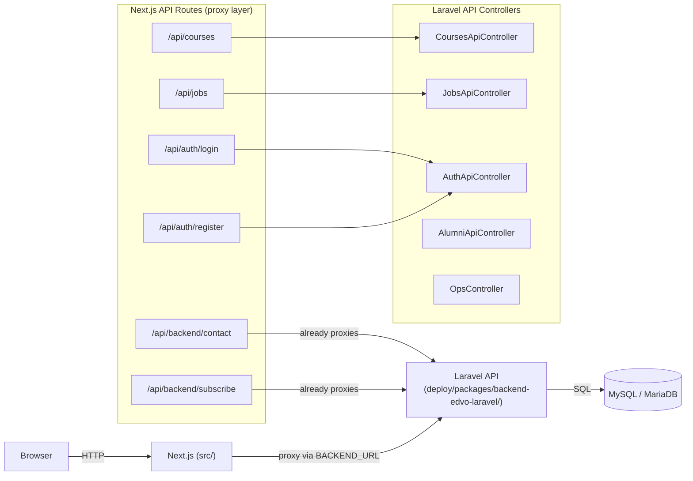

# Design Document: Backend API Integration

## Overview

This design covers building the JSON REST API layer on top of the existing Laravel 11 backend at `deploy/packages/backend-edvo-laravel/`. The frontend (Next.js in `src/`) already has proxy routes that forward to `BACKEND_URL`. The goal is to make the backend serve all the data shapes the frontend expects, ship a single SQL seed file, and enable zero-terminal deployment.

The existing backend has Inertia-based web controllers, models, and migrations already in place. We are adding a thin JSON API layer on top — new controllers in `app/Http/Controllers/Api/`, new routes in `routes/api.php`, and a single `database/edvo_seed.sql` file.

No frontend files will be modified. The frontend proxy routes (`/api/courses`, `/api/jobs`, `/api/auth/*`) will be updated to forward to the backend instead of returning mock data — these are the only frontend files touched.

---

## Architecture



The frontend proxy routes for contact and subscribe already work — they forward to `BACKEND_URL/api/contact-messages` and `BACKEND_URL/api/subscribes` which are already implemented in `routes/api.php`. The only work there is ensuring CORS headers are correct.

The courses, jobs, and auth routes currently return mock data. They will be updated to proxy to the backend, matching the same pattern as the contact/subscribe routes.

---

## Components and Interfaces

### API Endpoint Map

| Method | Path | Controller | Auth | Notes |
|--------|------|-----------|------|-------|
| GET | `/api/courses` | `CoursesApiController@index` | none | filter: category, level, search, sort |
| GET | `/api/courses/{id}` | `CoursesApiController@show` | none | full detail with sections/lessons |
| GET | `/api/jobs` | `JobsApiController@index` | none | filter: type, location, search, experience |
| POST | `/api/auth/register` | `AuthApiController@register` | none | returns token |
| POST | `/api/auth/login` | `AuthApiController@login` | none | returns token |
| POST | `/api/auth/logout` | `AuthApiController@logout` | sanctum | revokes token |
| GET | `/api/auth/me` | `AuthApiController@me` | sanctum | returns user profile |
| GET | `/api/alumni/achievements` | `AlumniApiController@achievements` | none | featured first |
| GET | `/api/alumni/stats` | `AlumniApiController@stats` | none | aggregate counts |
| POST | `/api/contact-messages` | closure in api.php | none | already exists |
| POST | `/api/subscribes` | closure in api.php | none | already exists |
| GET | `/__ops/migrate` | `OpsController@migrate` | OPS_TOKEN | zero-terminal deploy |

### Controller Structure

All new controllers live in `app/Http/Controllers/Api/` and extend the base `Controller`.

**CoursesApiController** — reads from `courses` table joined with `instructors`, `course_categories`, `course_reviews` (for avg rating + count), `course_enrollments` (for student count), `course_requirements`, `course_outcomes`, `course_sections` + `section_lessons` (for curriculum). Applies query filters before returning.

**JobsApiController** — reads from `job_circulars` table. Maps backend column names (`job_type`, `work_type`, `salary_min`/`salary_max`) to the frontend `Job` shape (`type`, `salary` as formatted string, etc.). Filters by `job_type`, `location`, `skills_required`, `experience_level`. Default sort: `created_at DESC`.

**AuthApiController** — wraps Laravel Sanctum. `register` creates a user with `role = 'student'`, calls `createToken()`, returns the token plaintext. `login` uses `Auth::attempt()`. `logout` calls `currentAccessToken()->delete()`. `me` returns `auth()->user()`.

**AlumniApiController** — reads from `alumni_achievements` with `user` and `bootcamp` eager-loaded. Orders featured records first (`ORDER BY featured DESC, created_at DESC`). Stats query uses `COUNT` aggregates.

**OpsController** — checks `request->query('token') === env('OPS_TOKEN')`, then runs `Artisan::call('migrate', ['--force' => true])` and returns the output as JSON.

### Response Format

All API responses follow a consistent envelope:

```json
// Success list
{ "success": true, "data": [...], "count": N }

// Success single
{ "success": true, "data": {...} }

// Auth success
{ "success": true, "data": { "user": {...}, "token": "..." } }

// Validation error
{ "success": false, "errors": { "field": ["message"] } }

// Auth error
{ "success": false, "error": "Invalid credentials" }

// Created (contact, subscribe)
{ "message": "...", "data": {...} }
```

The contact and subscribe endpoints keep their existing response shape (no `success` wrapper) since the frontend proxy already handles them.

### Frontend Proxy Updates

Three Next.js API route files need to be converted from mock-data handlers to backend proxies. The pattern is identical to the existing `src/app/api/backend/contact/route.ts`:

- `src/app/api/courses/route.ts` — GET forwards to `{BACKEND_URL}/api/courses` with query params passed through
- `src/app/api/jobs/route.ts` — GET forwards to `{BACKEND_URL}/api/jobs` with query params passed through  
- `src/app/api/auth/login/route.ts` — POST forwards to `{BACKEND_URL}/api/auth/login`
- `src/app/api/auth/register/route.ts` — POST forwards to `{BACKEND_URL}/api/auth/register`

Each proxy: reads `BACKEND_URL`, forwards the request with `Content-Type: application/json` and `Accept: application/json`, pipes the response status and body back unchanged.

---

## Data Models

### Course Response Shape (mapped from DB)

The `courses` table uses different column names than the frontend `Course` type. The controller maps them:

| Frontend field | DB source |
|---|---|
| `id` | `courses.id` (cast to string) |
| `title` | `courses.title` |
| `description` | `courses.short_description` |
| `thumbnail` | `courses.thumbnail` |
| `instructorId` | `courses.instructor_id` (cast to string) |
| `instructorName` | `instructors.user.name` (via eager load) |
| `price` | `courses.price` |
| `originalPrice` | `courses.discount_price` (when discount=true, original is `price`, discounted is `discount_price`) |
| `discount` | computed: `round((price - discount_price) / price * 100)` |
| `rating` | `AVG(course_reviews.rating)` |
| `reviewCount` | `COUNT(course_reviews.id)` |
| `studentsEnrolled` | `COUNT(course_enrollments.id)` |
| `duration` | computed from sum of section lesson durations, or stored string |
| `lectures` | `COUNT(section_lessons.id)` |
| `level` | `courses.level` |
| `category` | `course_categories.name` |
| `tags` | derived from category + level + title keywords |
| `whatYouWillLearn` | `course_outcomes.outcome` (array) |
| `requirements` | `course_requirements.requirement` (array) |
| `curriculum` | `course_sections` with nested `section_lessons` |
| `published` | `courses.status === 'published'` |

### Job Response Shape (mapped from DB)

The `job_circulars` table maps to the frontend `Job` type:

| Frontend field | DB source |
|---|---|
| `id` | `job_circulars.id` (cast to string) |
| `title` | `job_circulars.title` |
| `company` | `job_circulars.contact_email` domain, or a `company` column to be added |
| `logo` | `/images/companies/{slug}.png` (static path) |
| `location` | `job_circulars.location` |
| `type` | `job_circulars.job_type` (full-time, part-time, internship) or `work_type` (remote) |
| `salary` | formatted from `salary_min`, `salary_max`, `salary_currency` |
| `description` | `job_circulars.description` |
| `requirements` | parsed from description or separate column |
| `skills` | `job_circulars.skills_required` (JSON array) |
| `experience` | `job_circulars.experience_level` |
| `postedDate` | `job_circulars.created_at` |
| `applicationDeadline` | `job_circulars.application_deadline` |
| `applicants` | `job_circulars.positions_available` (repurposed, or add `applicants` column) |

> Note: The `job_circulars` table lacks `company` and `applicants` columns. The SQL seed file will add these via `ALTER TABLE` or the seed data will use the existing columns creatively. The design opts to add a `company` column and an `applicants` column in the seed SQL using `ALTER TABLE ... ADD COLUMN IF NOT EXISTS`.

### SQL Schema Overview

The seed file (`database/edvo_seed.sql`) contains:

1. `CREATE TABLE IF NOT EXISTS` for all tables (derived from existing migrations)
2. `ALTER TABLE ... ADD COLUMN IF NOT EXISTS` for any missing columns needed by the API
3. `INSERT IGNORE INTO` for all seed data

Key tables and their seed counts:
- `users`: 1 admin + 2 instructors + 5 students = 8 rows
- `instructors`: 2 rows (linked to instructor users)
- `course_categories`: 5 rows (Programming, Physics, Web Development, Mathematics, Data Science)
- `courses`: 5 rows (matching frontend mock data)
- `course_requirements`: ~3 rows per course
- `course_outcomes`: ~4 rows per course
- `course_sections`: ~1 section per course (for curriculum shape)
- `section_lessons`: ~2 lessons per section
- `course_reviews`: ~3 reviews per course (to produce realistic avg rating)
- `course_enrollments`: 5 rows (one per student, each in a different course)
- `job_circulars`: 5 rows (matching frontend mock data)
- `alumni_achievements`: 3 rows (placement, promotion, achievement types)
- `personal_access_tokens`: empty (populated at runtime)

---

## Correctness Properties

*A property is a characteristic or behavior that should hold true across all valid executions of a system — essentially, a formal statement about what the system should do. Properties serve as the bridge between human-readable specifications and machine-verifiable correctness guarantees.*

### Property 1: Course list response shape and completeness

*For any* set of published courses in the database, a GET to `/api/courses` must return a response where `count` equals `len(data)` and every item in `data` contains all required fields: `id`, `title`, `description`, `thumbnail`, `instructorId`, `instructorName`, `price`, `rating`, `reviewCount`, `studentsEnrolled`, `duration`, `lectures`, `level`, `category`, `published`.

**Validates: Requirements 1.1, 1.5**

### Property 2: Course filter correctness

*For any* filter value passed as `category`, `level`, or `search`, every course returned in the response must satisfy that filter condition. No course that fails the filter condition may appear in the results.

**Validates: Requirements 1.2, 1.4**

### Property 3: Course detail round-trip

*For any* course that exists in the database, a GET to `/api/courses/{id}` must return a response whose `data.id` matches the requested id and whose `data` includes `curriculum`, `whatYouWillLearn`, and `requirements` arrays.

**Validates: Requirements 1.3**

### Property 4: Job list response shape and completeness

*For any* set of active job circulars in the database, a GET to `/api/jobs` must return a response where `count` equals `len(data)` and every item contains all required fields: `id`, `title`, `company`, `location`, `type`, `salary`, `description`, `skills`, `experience`, `postedDate`, `applicants`.

**Validates: Requirements 2.1, 2.3**

### Property 5: Job filter correctness

*For any* filter value passed as `type`, `location`, or `search`, every job returned must satisfy that filter. Jobs that do not match the filter must not appear in the results.

**Validates: Requirements 2.2**

### Property 6: Job default sort order

*For any* response from GET `/api/jobs` with no sort parameter, for every adjacent pair of jobs `(a, b)` in the response, `a.postedDate >= b.postedDate` must hold.

**Validates: Requirements 2.4**

### Property 7: Contact message persistence round-trip

*For any* valid contact message payload (name, email, message), a POST to `/api/contact-messages` must return HTTP 201 and the record must be retrievable from the `contact_messages` table.

**Validates: Requirements 3.1**

### Property 8: Contact and subscribe validation rejection

*For any* POST to `/api/contact-messages` missing `name`, `email`, or `message`, the response must be HTTP 422. *For any* POST to `/api/subscribes` with a duplicate email, the response must be HTTP 422.

**Validates: Requirements 3.2, 3.4**

### Property 9: Subscribe persistence round-trip

*For any* valid unique email, a POST to `/api/subscribes` must return HTTP 201 and the email must be present in the `subscribes` table.

**Validates: Requirements 3.3**

### Property 10: Auth register → login → me round-trip

*For any* valid registration payload, the sequence register → login → GET /me must return the same user `id` and `email` at each step, with `role = 'student'` on the registered user.

**Validates: Requirements 4.1, 4.3, 4.6**

### Property 11: Auth error conditions

*For any* registration attempt with a duplicate email, the response must be HTTP 422. *For any* login attempt with invalid credentials, the response must be HTTP 401.

**Validates: Requirements 4.2, 4.4**

### Property 12: Token revocation

*For any* valid Sanctum token, after a POST to `/api/auth/logout`, a subsequent GET to `/api/auth/me` with that same token must return HTTP 401.

**Validates: Requirements 4.5**

### Property 13: Alumni achievements response shape

*For any* alumni achievement in the database, a GET to `/api/alumni/achievements` must include that achievement in the response with all required fields: `type`, `company_name`, `position`, `description`, `testimonial`, `featured`, `achievement_date`, and nested `user` object.

**Validates: Requirements 5.1**

### Property 14: Alumni featured ordering

*For any* response from GET `/api/alumni/achievements`, all records where `featured = true` must appear before any record where `featured = false`.

**Validates: Requirements 5.3**

### Property 15: Alumni stats consistency

*For any* database state, the `placements` value in GET `/api/alumni/stats` must equal the count of `alumni_achievements` rows where `type = 'placement'`, and `companies` must equal the count of distinct non-null `company_name` values.

**Validates: Requirements 5.2**

### Property 16: SQL seed idempotence

*For any* MySQL/MariaDB database, running `edvo_seed.sql` twice must produce the same final state as running it once — no duplicate key errors, no extra rows.

**Validates: Requirements 6.3**

### Property 17: OPS endpoint token protection

*For any* request to `GET /__ops/migrate` without the correct `OPS_TOKEN` query parameter, the response must be HTTP 401 or HTTP 403. Only a request with the exact matching token may trigger the migration.

**Validates: Requirements 7.1**

### Property 18: CORS preflight response

*For any* OPTIONS request to any `/api/*` endpoint, the response must be HTTP 200 and must include `Access-Control-Allow-Origin`, `Access-Control-Allow-Methods`, and `Access-Control-Allow-Headers` (including `Authorization`, `Content-Type`, `Accept`).

**Validates: Requirements 8.1, 8.2, 8.3**

### Property 19: Frontend proxy forwarding

*For any* valid `BACKEND_URL`, a request to the Next.js proxy routes (`/api/courses`, `/api/jobs`, `/api/auth/login`, `/api/auth/register`) must forward to the backend and return the backend's response status and body unchanged.

**Validates: Requirements 7.4**

---

## Error Handling

**Validation errors** — Laravel's built-in `$request->validate()` throws `ValidationException` which the framework converts to HTTP 422 with `{ errors: { field: [...] } }`. The API controllers wrap this in `{ success: false, errors: {...} }` via a custom exception handler or by catching `ValidationException` explicitly.

**Authentication errors** — `AuthApiController@login` returns `{ success: false, error: 'Invalid credentials' }` with HTTP 401 when `Auth::attempt()` fails. Sanctum middleware returns HTTP 401 for missing/invalid tokens on protected routes.

**Not found** — `CoursesApiController@show` returns `{ success: false, error: 'Course not found' }` with HTTP 404 when the course id does not exist.

**OPS token mismatch** — `OpsController@migrate` returns HTTP 403 with `{ error: 'Forbidden' }` when the token does not match.

**CORS** — The existing `config/cors.php` already has `'allowed_origins' => ['*']`. For production, this should be tightened to the frontend domain via `FRONTEND_URL` env var. The design keeps `['*']` as the default to avoid blocking shared-hosting deployments where the frontend URL may vary.

**Unhandled exceptions** — Laravel's default exception handler returns HTTP 500. `APP_DEBUG=false` in production ensures stack traces are not leaked.

---

## Testing Strategy

### Unit Tests

Unit tests cover specific examples, edge cases, and error conditions:

- `CoursesApiController`: test that a course with `status != 'published'` is excluded from the list response
- `JobsApiController`: test that the salary formatter produces the correct string for various min/max/currency combinations
- `AuthApiController`: test that `register` sets `role = 'student'` regardless of any `role` field in the request body
- `OpsController`: test that a missing token returns 403, a wrong token returns 403, and the correct token triggers migration
- SQL seed: test that the admin user's password hash verifies against `Admin@123` using `password_verify()`

### Property-Based Tests

Property-based tests use **PestPHP** (already the standard test runner for Laravel 11) with the **[pest-plugin-faker](https://github.com/pestphp/pest-plugin-faker)** for data generation, combined with a simple property loop pattern (100 iterations minimum per property).

Each property test is tagged with a comment referencing the design property number.

**Tag format:** `// Feature: backend-api-integration, Property {N}: {property_text}`

Property test outline:

```php
// Feature: backend-api-integration, Property 1: Course list response shape and completeness
it('returns all published courses with required fields', function () {
    // Generate N random published courses, insert them
    // GET /api/courses
    // Assert count == len(data)
    // Assert every item has all required fields
})->repeat(100);

// Feature: backend-api-integration, Property 2: Course filter correctness
it('filters courses by category correctly', function () {
    // Generate random courses across random categories
    // GET /api/courses?category={random_category}
    // Assert every returned course has that category
})->repeat(100);

// Feature: backend-api-integration, Property 10: Auth register → login → me round-trip
it('register then login then me returns consistent user', function () {
    // Generate random valid user payload
    // POST /api/auth/register → capture token
    // POST /api/auth/login → capture token
    // GET /api/auth/me with token → assert same id, email, role=student
})->repeat(100);

// Feature: backend-api-integration, Property 16: SQL seed idempotence
it('running seed SQL twice produces no duplicate key errors', function () {
    // Run edvo_seed.sql
    // Run edvo_seed.sql again
    // Assert no exception thrown, row counts unchanged
})->once(); // idempotence test runs once with two executions
```

**Property test configuration:**
- Minimum 100 iterations per property (use `->repeat(100)` in Pest or a `for` loop)
- Each property test must reference its design document property via the tag comment
- Tests run against an in-memory SQLite database (`:memory:`) for speed, with MySQL integration tests run separately against the seed SQL

### Integration Tests

- Upload `edvo_seed.sql` to a fresh MySQL instance, verify row counts match requirements
- Run the full register → login → me → logout → me sequence against a live Laravel instance
- Verify CORS headers on a preflight OPTIONS request to `/api/courses`
